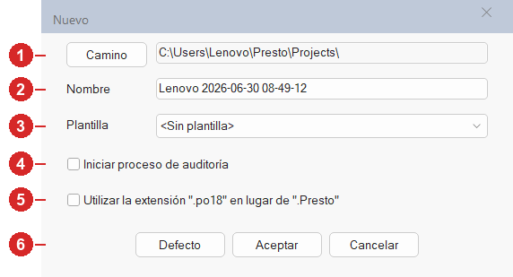
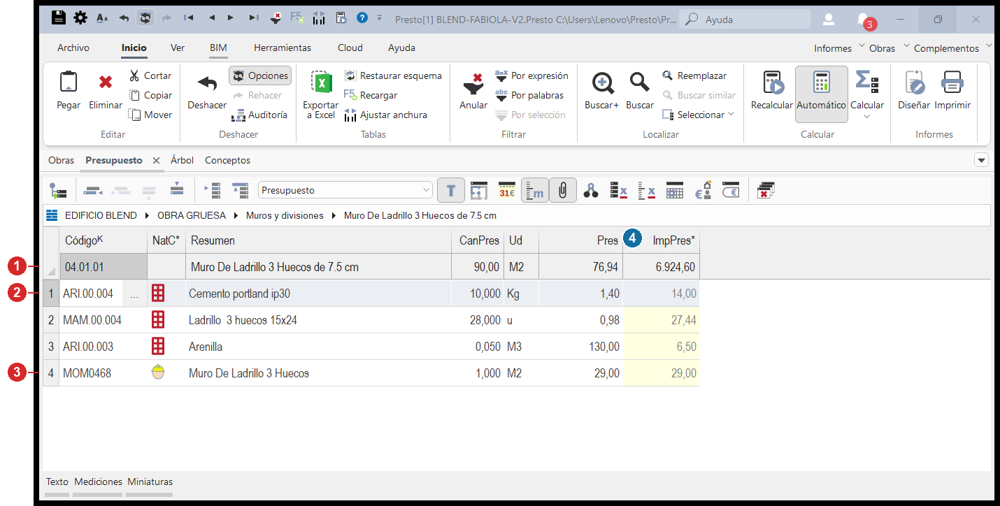

# 1 · Presupuesto básico

!!! abstract "Conclusión primero"
    En esta sección armás un presupuesto **de cero**: configurás el entorno, creás la obra, levantás la estructura de capítulos y partidas, le decís a Presto qué es cada cosa (naturalezas), definís las monedas, armás tu primer APU y sacás un informe. Es el **primer día** del curso y la base de todo lo demás.

!!! tip "Antes de arrancar, tené a mano el mapa"
    Las instrucciones de abajo usan palabras como _"la cinta de arriba"_, _"la franja de abajo"_, _"el grupo Filtrar"_. Si algo no lo ubicás, abrí en otra pestaña **[🗺 La pantalla de Presto](interfaz.md)** — es el mapa con cada zona numerada. Volvé a él cuando te pierdas.

!!! info "De dónde sale este contenido"
    Apunte de capacitación **CL-1 (Presupuesto Básico)** + **Manual de Presto completo (RIB)**. Cada paso cita el minuto `[hh:mm]` del video por si querés verlo.

---

## Antes de empezar: lo que necesitás

| Necesitás | Por qué |
|---|---|
| **Presto instalado** (idealmente con licencia) | La ventana de Activación muestra licencia, versión y módulos |
| **Las tres ventanas abiertas**: Árbol, Presupuesto, Conceptos | Son las tres fundamentales (se prenden desde el menú `Ver`) |
| **El esquema de columnas en `Presupuesto`** | Si estás en otro esquema, te faltan columnas clave (le pasó a Enrique en vivo) |
| **Un borrador del itemizado** (un Excel: Código · Unidad · Descripción · Cantidad) | Si vas a copiar/pegar en vez de teclear todo |

---

## Tarea 1 — Configurar el entorno (una sola vez por computadora)

**Qué es:** dejar Presto configurado como conviene, antes de trabajar. Se hace **una sola vez** por computadora.

**Por qué importa:** trabajar siempre en MAYÚSCULAS evita problemas con los filtros y las búsquedas más adelante.

**Paso a paso** `[00:00]`:

1. Andá a la **cinta de arriba** y hacé clic en la pestaña **`Archivo`** (la primera de todas, arriba a la izquierda). Se abre una pantalla a toda página (el "backstage").
2. En la **columna de opciones de la izquierda**, buscá y hacé clic en **`Entorno de trabajo`** (está más abajo en la lista). Se abre una ventana con varias secciones.
3. Entrá a la sección **`Generales`**. Dejá **marcadas** las casillas de **ajuste automático de ancho de columnas** y **cálculo automático** (ya vienen así; no las toques).
4. **Destildá** la casilla **"aceptar códigos en minúsculas"**. Así Presto convierte solo todos los códigos a MAYÚSCULAS.
5. **Destildá** también **"actualizar solo la ventana de tabla activa"**. Así, cuando cambiás algo en una ventana, se actualiza al toque en las demás.
6. Hacé clic en **`Aceptar`** abajo para guardar.

!!! note "¿Por qué MAYÚSCULAS?"
    Presto distingue `MAT001` de `mat001` cuando buscás o filtrás. Si todos los códigos están en mayúscula, nunca te falla una búsqueda por una minúscula traicionera.

---

## Tarea 2 — Crear una obra nueva (con auditoría)

**Qué es:** arrancar un presupuesto desde cero.

**Cómo llegar:** en la **cinta de arriba**, pestaña **`Archivo`** ▸ y en la columna de la izquierda, **`Nuevo`**. Se abre esta ventana flotante:

{ .on-glb }

**Qué hacés en cada campo** (los números son los de la imagen):

| # | Campo | Qué hacés |
|---|---|---|
| **1** | **Camino** | La carpeta donde se guarda la obra. El botón `Defecto` apunta al directorio predeterminado. ⚠️ Elegí una carpeta **local**, no OneDrive. |
| **2** | **Nombre** | El nombre de la obra (el que quieras; Presto sugiere uno con la fecha). |
| **3** | **Plantilla** | Dejá **`<Sin plantilla>`** para partir de cero. _(Las plantillas traen capítulos predefinidos que pueden chocar con tu estructura.)_ |
| **4** | **Iniciar proceso de auditoría** | Marcala _(recomendado)_: crea puntos de restauración automáticos. |
| **5** | **Utilizar la extensión ".po18"** | Dejala **desmarcada** (usa el formato `.Presto` normal). |
| **6** | **Aceptar** | Hacé clic para crear la obra. _(Al lado están `Defecto` y `Cancelar`.)_ |

!!! warning "Cuidado con el archivo de auditoría"
    La auditoría (casilla 4) crea un archivo especial **junto** al `.presto`. Si movés la obra a otra computadora, **mové también ese archivo** o perdés los puntos de restauración.

!!! tip "Gotcha de Raizant: nunca crees la obra dentro de OneDrive"
    En el campo **Camino** (1), elegí una **carpeta local** (ej. `C:\Presto\Obras\`). Varias funciones de Presto (Excel2Presto, importar) **solo leen archivos locales, no de OneDrive**. La copia final a OneDrive la sincronizás aparte.

---

## Tarea 3 — Armar la estructura: capítulos, subcapítulos y partidas

**Qué es:** levantar el esqueleto del presupuesto (los capítulos y, dentro, las partidas).

**Cómo piensa Presto:** trabajás por **niveles**, como carpetas. Un capítulo es una carpeta; entrás "adentro" con doble clic y ahí van sus partidas.

**Dónde estás:** en la pestaña de ventana **`Presupuesto`** (la fila de pestañas del medio: Obras · **Presupuesto** · Árbol · Conceptos). La tabla grande de abajo es donde escribís.

**Paso a paso** `[00:40]`:

1. En la **franja de abajo** (la tabla), hacé clic en la primera celda de la columna **`Código`** (la de más a la izquierda). Escribí el código del primer capítulo.
2. Apretá **Tab** (la tecla ⭾, arriba a la izquierda del teclado): el cursor salta a la columna **`Resumen`**. Ahí escribí el nombre del capítulo (ej. "Obra gruesa").
3. Apretá **Enter**: Presto crea la fila de abajo, lista para el siguiente.
4. **Creá primero todos los capítulos** (los del mismo nivel), uno debajo del otro. Todavía no metas las partidas adentro.
5. **Para meter partidas dentro de un capítulo** (anidar): seleccioná las filas haciendo clic en su **número de fila** (la columnita gris del extremo izquierdo) y después, en la **cinta de arriba**, buscá el botón **`Disminuir nivel`**. Las filas quedan "adentro" del capítulo de arriba.
6. **Para entrar a un capítulo** (ver/editar lo que tiene adentro): **doble clic** en cualquier celda de su fila. **Para salir y subir un nivel**: doble clic en cualquier **título de columna** (la fila gris de arriba de la tabla, donde dice "Código", "Resumen", etc.).

!!! tip "Si te equivocaste de nivel"
    Tenés `Aumentar nivel` (lo saca para afuera) y `Deshacer` (Ctrl+Z) en la misma zona de la cinta. No hay forma de romper nada que no se pueda deshacer.

---

## Tarea 4 — Copiar y pegar el borrador desde Excel

**Qué es:** traer un itemizado que ya tenés en Excel, sin teclearlo todo.

!!! note "Método simple vs. método pro"
    Acá usamos copiar/pegar simple. El método automatizado (**Excel2Presto**) se enseña en [Presupuesto intermedio](2-intermedio.md) — es más eficiente, pero conviene entender este primero.

**La clave:** las columnas de Presto y las de tu Excel tienen que estar **en el mismo orden** para que peguen alineadas.

**Paso a paso** `[00:50]`–`[01:00]`:

1. Abrí tu Excel y mirá en qué orden están las columnas (ej.: Código · Unidad · Descripción · Cantidad).
2. En Presto, en la **franja de abajo** (la tabla), hacé **clic derecho sobre cualquier título de columna** (la fila gris de arriba). En el menú que aparece, elegí **`Elegir columnas visibles`**.
3. Se abre una ventana con dos listas. Con los botones **`Subir`/`Bajar`** ordená las columnas de Presto para que **queden igual que tu Excel**: `Código` · `Ud` · `Resumen` · `CanPres`. Dale `Aceptar`.
4. Volvé al Excel, seleccioná tus datos y copiá (**Ctrl+C**). Volvé a Presto y pegá: en la **cinta de arriba**, pestaña `Inicio`, grupo **Editar**, botón **`Pegar`** (o directamente **Ctrl+V**).
5. Ahora anidá los subcapítulos y partidas con **`Disminuir nivel`** (como en la Tarea 3).
6. Cuando termines, devolvé las columnas a su orden normal: **cinta de arriba ▸ Inicio ▸ grupo Tablas ▸ `Restaurar esquema`**.

!!! warning "Si no aparece la columna `CanPres` en la lista"
    Casi seguro es porque la ventana está en **otro esquema**, no en `Presupuesto`. Mirá el **desplegable que está arriba a la derecha de la tabla** (zona 11 del mapa) y cambialo a `Presupuesto`. _(Esto le pasó a Enrique en vivo.)_

---

## Tarea 5 — Decirle a Presto qué es cada cosa (naturalezas)

**Qué es:** marcar si cada fila es un capítulo, una partida, un material, mano de obra, etc. Presto lo necesita para que los informes salgan bien.

**Dónde mirar:** la columna **`NatC`** (la segunda de la tabla, justo después de Código — zona 14 del mapa). Ahí cada fila tiene un **ícono** que indica qué es.

**Paso a paso** `[01:10]`:

1. Mirá la columna **`NatC`**. Los de arriba de todo suelen salir como **capítulo**; los que pegaste salen como **partida** (ícono rojo).
2. **Para cambiar la naturaleza de una fila:** hacé **clic derecho sobre su ícono** en la columna `NatC`. Se abre un menú: elegí lo que corresponda (capítulo/subcapítulo, partida, material, mano de obra, maquinaria, otros).
3. **Para cambiar varias de una:** seleccioná toda la columna haciendo clic en su título `NatC`, y cambiá en bloque.
4. **Los subcapítulos:** cambialos de "partida" a naturaleza **capítulo**.

!!! danger "Regla de oro: niveles parejos"
    Dentro de un mismo capítulo, todo lo que cuelga tiene que ser **del mismo tipo**: o todos subcapítulos, o todas partidas. Si mezclás, **Presto no te avisa pero los informes salen mal**. Ver [Reglas de oro](5-reglas-de-oro.md).

!!! tip "Truco: que Presto ponga la naturaleza solo"
    En `Archivo ▸ ... ▸ Propiedades ▸ Varios` podés decirle: "los códigos que empiezan con `M` son material, los que empiezan con `O` son mano de obra". Después, cualquier código nuevo recibe su naturaleza automáticamente. `[01:30]`

---

## Tarea 6 — Definir las monedas (¡antes de poner precios!)

**Qué es:** configurar con qué monedas trabajás y cuál es la principal.

**Por qué importa tanto:** en el curso le dedican ~20 minutos. Si te lo salteás, **los informes no suman bien**. Es el error #1 que reportan a soporte.

**Cómo llegar:** en la **cinta de arriba**, pestaña **`Ver`**, botón **`Propiedades`**. Se abre una ventana con secciones a la izquierda.

**Paso a paso** `[01:20]`–`[01:30]`:

1. En la sección **`Datos`**: poné el **`Resumen`** (el nombre de la obra; sale en el encabezado de los informes) y la dirección.
2. Entrá a la sección **`Divisas`**: armá la tabla de monedas (hasta **6**). Por cada moneda cargás: su código (ej. USD, BOB), una sigla corta, la **paridad** (cuánto vale respecto de la principal) y la fecha. Elegí una como referencia (vale 1) y poné las otras por regla de 3.
3. Volvé a **`Datos`** y, en el campo **`Divisa`**, fijá la **moneda de consolidación** — la moneda principal en la que se ve toda la obra (para Bolivia, normalmente **BOB**).

!!! warning "Presto NO se conecta a internet para el tipo de cambio"
    La paridad la cargás **a mano** y después le das `Recalcular`. Si el tipo de cambio queda viejo, nadie te avisa. _(Es algo que podemos automatizar por fuera más adelante.)_

!!! tip "El truco para emitir el presupuesto en cualquier moneda"
    Dejá el campo `Divisa` **vacío** en los capítulos y partidas (el esqueleto), y poné la moneda **solo en los recursos** que están en otra divisa (ej. un material importado en USD). Así, cambiando la moneda principal, Presto reproyecta TODO solo, sin que toques nada.

---

## Tarea 7 — Armar tu primer APU (a mano)

**Qué es:** la "receta" de una partida — descomponerla en sus materiales, mano de obra y maquinaria, con cuánto lleva de cada uno y a qué precio.

**Así se ve un APU ya armado** (la partida "Muro de ladrillo" abierta, con su receta adentro):

{ .on-glb }

| # | Qué es |
|---|---|
| **1** | **La partida** (la fila gris de arriba): "Muro de ladrillo", 90 M2 a 76,94 c/u. Su precio (76,94) está en **magenta** = lo calcula Presto desde la receta de abajo. |
| **2** | **Un material** de la receta: Cemento, 10 kg a 1,40. Fijate que la cantidad es **chica** (lo que lleva 1 m² de muro) y tiene **unidad real** (Kg). El íconito rojo en la columna NatC = material. |
| **3** | **La mano de obra**: el íconito de **casco amarillo** la distingue de los materiales. |
| **4** | Las columnas de la receta: **CanPres** (cuánto lleva), **Ud** (unidad), **Pres** (precio unitario) e **ImpPres** (importe = cantidad × precio, se calcula solo). |

**Paso a paso para armar uno** `[01:40]`–`[02:00]`:

1. En la **franja de abajo** (la tabla), hacé **doble clic** sobre la fila de la partida que querés desglosar (ej. _Hormigón de vigas y pilares_). Entrás "adentro" de la partida; queda vacía, lista para su receta.
2. Escribí el primer recurso: en la columna **`Código`** poné su código y apretá **Tab** para pasar a **`Resumen`** y ponerle el nombre (ej. cemento, arena, peón). _Si configuraste el truco de la Tarea 5, Presto le pinta la naturaleza solo según la inicial del código._
3. Seguí apretando **Tab** para completar, en la misma fila:
    - **`CanPres`** = cuánto lleva de ese recurso **por una unidad** de la partida (el rendimiento).
    - **`Ud`** = la unidad (kg, m³, hora…).
    - **`Pres`** = el precio unitario de ese recurso.
4. La columna **`ImpPres`** (el importe) **se calcula sola** = cantidad × precio.
5. **La señal de que salió bien:** subí la vista a la fila de la partida. Su precio ahora aparece en **color magenta/rosado** → eso significa que Presto lo está calculando **desde tu receta**, no a dedo. 🎉

!!! tip "Leé el color del precio"
    **Magenta** = calculado (tiene receta debajo, ✅ bien). **Negro** = tecleado a mano (sin receta). Si esperabas magenta y ves negro, te faltó armar el APU. Ver [Fundamentos](0-fundamentos.md).

---

## Tarea 8 — Reusar APU de otra obra (arrastrar desde una "base")

**Qué es:** traer partidas o recetas ya armadas desde otra obra de referencia, sin teclearlas de nuevo.

**Paso a paso** `[02:20]`–`[02:50]`:

1. Abrí la obra de referencia: **cinta de arriba ▸ Archivo ▸ Abrir**, elegila, y **marcá la casilla "abrir como solo lectura"** (así no la pisás por accidente).
2. Ahora tenés dos ventanas de Presto. Acomodalas para verlas **lado a lado** en la pantalla, las dos en la pestaña `Presupuesto`.
3. En la obra de referencia, **seleccioná lo que querés llevarte**: para una fila entera, clic en su número de fila; para varias salteadas, mantené **Ctrl** y andá clickeando.
4. **Arrastrá**: hacé clic sostenido sobre la selección y, sin soltar, llevala hasta la tabla de tu obra nueva. Soltá. Podés arrastrar recursos sueltos o partidas completas (que se llevan toda su receta).

!!! note "Por qué importa para Raizant"
    Tener una **base de precios maestra** (recetas y precios ya validados) de la que arrastrar es la semilla de la "única fuente de verdad" de costos. Tu primer presupuesto bien hecho se vuelve la base de los siguientes.

---

## Tarea 9 — Mediciones: de dónde sale la cantidad de una partida

**Qué es:** en vez de escribir una cantidad "a dedo", desglosarla en sus parciales (por ejes, por losas, por sectores) para que quede respaldada.

**Dónde:** la subventana **`Mediciones`**, que aparece **abajo de la tabla** cuando la prendés.

**Paso a paso** `[03:20]`:

1. En la tabla, hacé clic en la partida que querés medir.
2. Prendé la subventana **`Mediciones`** (está en la barrita de íconos chiquitos arriba de la tabla, zona 12 del mapa — pasá el mouse por ellos hasta encontrar "Mediciones"). Aparece un panel abajo.
3. En la columna **`Comentario`** de ese panel, describí cada parcial (ej. "excavación ejes"). Apretá **Enter** para crear la línea siguiente.
4. En la columna **`Cantidad`**, escribí el valor de cada parcial (ej. 100, después 200, después 452).
5. Apretá **Recalcular** (cinta de arriba ▸ Inicio ▸ grupo Calcular, o la tecla **F5**). La cantidad de la partida, arriba, aparece en **magenta** = respaldada por tus mediciones (suma 752). ✅

---

## Tarea 10 — Sacar un informe

**Qué es:** generar el documento (el presupuesto, una receta, el listado de materiales) para imprimir o presentar.

**Cómo llegar:** en la **cinta de arriba**, todo a la derecha, está la pestaña/menú **`Informes`** (zona 9 del mapa).

**Paso a paso** `[03:20]`–`[03:30]`:

1. Abrí **`Informes`** y elegí uno de la lista. Están agrupados por país: buscá el grupo **14 (Bolivia)** → por ejemplo **`Presupuesto por ítem`**.
2. Aparece una **ventana de preguntas** (qué incluir, qué mostrar). Si dudás, dale el botón **`Defecto`** y listo.
3. Elegí qué hacer con el resultado:
    - **`Vista preliminar`** para verlo en pantalla. _(Ojo: esta ventana se cierra con la tecla **S**, no tiene la "X" típica.)_
    - **`Imprimir`** para mandarlo a la impresora.
    - **`Exportar`** para guardarlo como archivo.

!!! note "Dónde se ponen el % de utilidad y el IVA"
    El `% beneficio`, `% gastos generales`, `IVA` y la fecha del informe se configuran en **Propiedades ▸ Cálculo** y se aplican al imprimir — no se tocan en la tabla del presupuesto.

---

## Tarea 11 — Auditoría: volver atrás si algo salió mal

**Qué es:** ver el historial de cambios de la obra o volver a un estado anterior (si la creaste con auditoría, casilla 4 de la Tarea 2).

**Paso a paso** `[03:40]`:

1. En la **cinta de arriba**, pestaña `Inicio`, grupo **Deshacer**, hacé clic en **`Auditoría`**. Se abre la lista de puntos guardados (el más reciente arriba), con fecha, hora, usuario y el total del presupuesto en ese momento.
2. **Para volver a un estado:** seleccioná esa fila y hacé clic en **`Restaurar`**. Presto **no pisa tu archivo actual**: crea una **copia** con la fecha en el nombre.

!!! warning "Limpiá las copias que no uses"
    Presto no borra solo esas copias restauradas. Si una no te sirve, **borrala a mano** del explorador de Windows para no confundirte y abrir una versión vieja por error.

---

## 🎥 Mirá el video

| Tema | Minuto |
|---|---|
| Interfaz, licencia, entorno | `[00:00]` |
| Crear / abrir obra | `[00:10]`–`[00:20]` |
| Armar la estructura | `[00:30]`–`[01:10]` |
| Copiar/pegar de Excel | `[00:40]`–`[01:00]` |
| Naturalezas | `[01:10]` |
| Propiedades (divisas, redondeos) | `[01:20]`–`[01:40]` |
| APU a mano + Divisa | `[01:40]`–`[02:10]` |
| Arrastre desde base | `[02:20]`–`[02:50]` |
| Mediciones, informes | `[03:20]`–`[03:30]` |
| Auditoría | `[03:40]` |

> Video fuente: `CL-1 - Ppto Básico - Jueves 27_11_2025.mp4` (3h 47min). Relator de soporte de Presto Chile.

---

## ⚠️ Lo que Presto NO te avisa (resumen)

- **Naturaleza mal puesta o niveles mezclados** → informes rotos, en silencio.
- **Te olvidaste la divisa de un recurso** → importes mal, en silencio.
- **Botón `Automático` desactivado** (cinta ▸ Inicio ▸ grupo Calcular) → los totales se ven en cero (parece que "Presto está roto").
- **Estás en otro esquema de columnas** → te faltan columnas y creés que no existen.

👉 Todas, con cómo blindarte, en [4 · Reglas de oro y fallas silenciosas](5-reglas-de-oro.md).

---

## ✏️ Ejercicio en BLEND

!!! example "Practicá lo aprendido"
    Sobre la obra de prueba **BLEND**:

    1. Creá un capítulo nuevo "99 · PRUEBA [tu nombre]" con 2 partidas.
    2. Armá el APU de una de ellas con al menos 1 material + 1 mano de obra.
    3. Agregá una línea de medición a la otra partida y verificá que la cantidad quede en **magenta**.
    4. Sacá el informe `Presupuesto por ítem` (grupo Bolivia) y revisá que tu capítulo aparezca.

    **Cómo sabés que salió bien:** el precio de tu partida con APU aparece en magenta, y la cantidad con medición también. Si algo sale en negro donde esperabas magenta, revisá la receta.

---

📖 **Fuente oficial:** Presto-Presupuestos.pdf · Manual-de-Presto-completo.pdf (RIB). · Apunte: C02 — Presupuesto básico (casos de uso 1–19).
