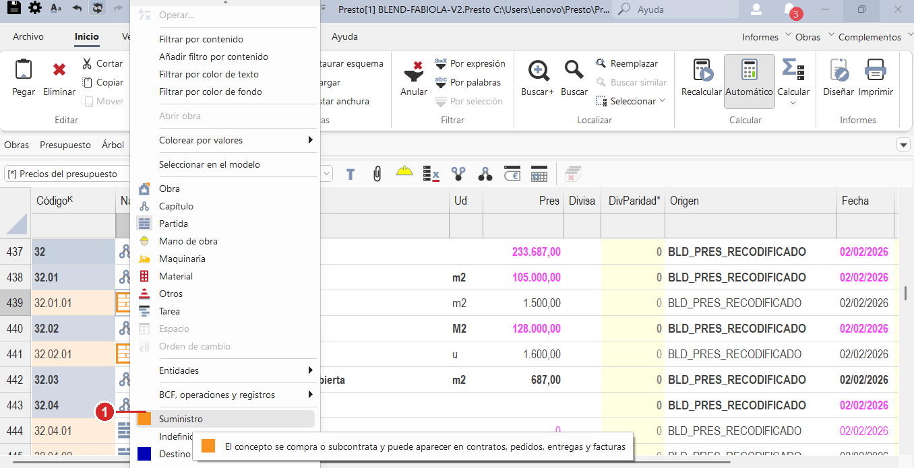

# 2 · Presupuesto intermedio

!!! abstract "Conclusión primero"
    Acá pasás de "armar el presupuesto" a "armarlo bien y a escala". Aprendés a importar de Excel con el método pro (**Excel2Presto**), a modelar **conceptos porcentaje** (leyes sociales, IVA) y **subcontratos**, a usar las columnas potentes del APU (`Código2`, `Factor`, `Nota`), a ajustar precios masivamente y a **exportar** — incluido el camino correcto para llevar el código contable a Excel.

!!! tip "¿Te perdés con los menús? Tené el mapa a mano"
    Cuando una instrucción diga "la cinta de arriba" o "el grupo Filtrar", mirá el **[🗺 mapa de la pantalla](interfaz.md)**.

!!! info "De dónde sale este contenido"
    Apunte **CL-2 (Presupuesto Intermedio)** + **capturas reales de pantalla** + manuales RIB. Asume que ya hiciste el [Presupuesto básico](1-basico.md). Cada paso cita el minuto `[hh:mm]` del video.

---

## Antes de empezar: lo que necesitás

| Necesitás | Por qué |
|---|---|
| Saber lo del [Presupuesto básico](1-basico.md) | CL-2 da por sabido todo lo de CL-1 |
| **Excel instalado** + el complemento **Excel2Presto** | Para importar el itemizado (Tarea 1) |
| **El Excel a importar en disco LOCAL, no en OneDrive** | Con archivo en la nube, Excel2Presto **falla garantizado** |
| Una tabla de Excel limpia (una sola fila de cabecera) | Una fila de datos perdida muy abajo cuelga el análisis |

---

## Tarea 1 — Importar un itemizado con Excel2Presto

**Qué es:** la forma rápida de llevar un presupuesto de Excel a Presto. A diferencia del copiar/pegar simple, **mira tus columnas, adivina qué es cada una y arma el árbol** (capítulos → partidas) solo.

**Importante:** esta herramienta vive **dentro de Excel** (no en Presto). Es un menú extra que aparece en la cinta de Excel.

**Paso a paso** `[00:00]`–`[01:00]`:

1. **Instalá el complemento** (una sola vez): cerrá Excel del todo. Andá con el explorador de Windows a `C:\Archivos de programa\Presto <versión>\Excel2Presto\` y hacé doble clic en **`setup`**. Volvé a abrir Excel: arriba, en la cinta de Excel, ahora aparece una pestaña nueva que dice **"Excel2Presto"**.
    - _Si no aparece:_ en Excel andá a `Archivo ▸ Opciones ▸ Complementos` y habilitalo a mano.
2. **Copiá tu Excel a una carpeta local** (NO OneDrive) y abrilo.
3. En la cinta de Excel, entrá a la pestaña **`Excel2Presto`** y hacé clic en **`Analizar`** (dejá las opciones como vienen). Aparece un panel mostrando cada columna con lo que Presto cree que es (A→Código, C→Resumen, D→Cantidad…).
4. **Si adivinó mal una columna:** hacé **clic derecho sobre el título de esa columna** en el panel y elegí lo correcto.
5. **Marcá cuáles filas son capítulos:** clic derecho sobre el número de una fila de capítulo → **`Tipo de línea capítulo`**. Presto la reconoce y **marca todas las filas parecidas de una vez** (no vas fila por fila).
6. En el **panel de la derecha**, activá **`Separa códigos por nivel`** para que las partidas queden anidadas dentro de sus capítulos.
7. Hacé clic en **`Exportar`** → te pide nombre y crea una obra `.presto`. _(La ventana no se cierra sola; cerrala vos y abrí esa obra en Presto.)_
8. Ya en Presto, si algo no quedó bien anidado, lo arreglás con **`Disminuir nivel`** (igual que en el básico).

!!! warning "Los dos errores que cuelgan Excel2Presto"
    - **Archivo en OneDrive/nube** → error seguro, no carga nada. Copialo a disco local primero.
    - **Una fila de datos perdida muy abajo** (ej. en la fila 25.000) → se queda pensando para siempre. Limpiá la tabla antes (que no haya datos sueltos lejos).

!!! danger "Cuidado: las marcas se contagian a todo lo parecido"
    Cuando marcás `Tipo de línea anulada` o `Celda excluida`, se aplica a **todas** las filas/celdas con contenido parecido. Si excluís un "m3", se excluyen **todos** los "m3". Mirá el panel (lo gris = no se exporta) antes de dar Exportar.

---

## Tarea 2 — Modelar un concepto PORCENTAJE (leyes sociales, IVA)

**Qué es:** una línea especial dentro del APU que calcula un porcentaje sobre los otros recursos (las cargas sociales sobre la mano de obra, el IVA sobre los materiales, etc.).

**Paso a paso** `[01:00]`–`[01:30]`:

1. Dentro de la receta (APU) de la partida, creá una fila nueva. En la columna **`Código`** escribí un código que **incluya el símbolo `%`**. Apenas lo ponés, Presto lo reconoce como porcentaje y le pinta el código de **anaranjado**.
2. **La parte del código antes del `%` le dice sobre QUÉ calcular.** Ejemplo: si escribís `O0%`, busca los recursos cuyo código empiece con `O0` (típicamente la mano de obra) y calcula el porcentaje sobre ellos.
3. En la columna **`Pres`** (precio) escribí el **número del porcentaje** (ej. `29` = 29%), **no un precio en plata**.
4. En **`Ud`** (unidad) poné `%`. Y en la naturaleza (columna `NatC`), poné una básica — por ejemplo **mano de obra**, para que las leyes sociales aparezcan junto a la MO en los informes.

!!! danger "La regla de oro del porcentaje: va SIEMPRE en la última fila"
    El porcentaje busca **solo hacia arriba** (las filas que tiene encima, en el mismo nivel). Por eso debe ir **al final de la receta**. Si después agregás una mano de obra **debajo** del porcentaje, **no la va a contar** — moveela arriba con los botones `Subir`/`Bajar`.

---

## Tarea 3 — Marcar un SUBCONTRATO (partida + suministro)

**Qué es:** una partida que hace un subcontratista a precio cerrado, sin desglose (muebles de cocina, instalaciones, etc.).

!!! note "En Presto no hay una naturaleza 'subcontrato'"
    Un subcontrato es **una partida normal + la propiedad 'Suministro' activada**. Es una marca que le ponés encima, no un tipo aparte.

**Paso a paso** `[01:30]`:

1. Dentro del capítulo que corresponde, creá la partida con **naturaleza `Partida`** (en la columna `NatC`).
2. Hacé **clic derecho sobre esa partida** y, en el menú, activá la propiedad **`Suministro`** (el número **1** de la imagen). Su ícono se pone **naranja 🟧** — esa es la señal de que quedó marcada como subcontrato.

    { .on-glb }

    _El recuadro de ayuda lo confirma: "el concepto se compra o subcontrata y puede aparecer en contratos, pedidos, entregas y facturas"._

3. Cargala simple: **cantidad `1`**, **unidad `global`**, y en `Pres` el **precio cerrado** que te pasó el subcontratista. **No le pongas receta adentro.**

!!! warning "No confundas con el ícono 'Subcontratista'"
    Hay otro ícono llamado "Subcontratista" en otros menús — ese es de la ventana de proveedores (Entidades) y **NO sirve** para esto. Lo que marca el subcontrato es la propiedad **Suministro** sobre la partida.

!!! tip "Por qué importa marcarlo bien"
    Una partida-subcontrato bien marcada es lo que después permite encadenarla a Contratos → Pedidos → Entregas → Facturas. Si está mal marcada, no fluye. Conviene que el equipo se ponga de acuerdo en marcarlas siempre igual.

---

## Tarea 4 — Las columnas potentes: Código2, Factor, Nota

**Qué es:** hay columnas muy útiles que vienen **escondidas** por defecto. Acá las activás.

**Cómo mostrarlas** `[01:40]`:

1. En la tabla, hacé **clic derecho sobre cualquier título de columna** (la fila gris de arriba) → elegí **`Elegir columnas visibles`**.
2. Se abre una ventana con un buscador. ⚠️ Es **sensible a tildes y mayúsculas**, así que escribí bien. Buscá y pasá a la lista de visibles: **`Código2`**, **`Factor`**, **`FactorExp`** y **`Nota`**.
3. Dale `Aceptar`. Ahora esas columnas aparecen en la tabla.

### Código2 — el puente con la contabilidad

!!! abstract "Lo importante de Código2"
    Es un **código secundario** que le ponés a cada concepto. A diferencia del `Código` normal (que es único e irrepetible), el **`Código2` se puede repetir** — por eso varios conceptos pueden compartir la **misma cuenta contable** de Syneco. Es la forma nativa de conectar el presupuesto con el plan de cuentas.

### Factor / FactorExp — mermas, viajes, rendimientos

- La columna **`Factor` no se escribe** (tiene fondo amarillo = solo lectura). El valor lo ponés en la columna de al lado, **`FactorExp`**, como una fórmula.
- Ejemplos para `FactorExp`: 5% de desperdicio → escribís `1,05`. Pérdida × cantidad de viajes → `1,05*2`. Inverso de un rendimiento → `1/1,0526`.
- El factor **multiplica la cantidad sin cambiarla** (la cantidad original queda intacta; el factor actúa por detrás).
- La columna **`Nota`** es para que anotes qué significa cada factor (ej. "factor por merma de obra").

---

## Tarea 5 — Ajustar precios de a muchos (Operar y Ajustar)

**Qué es:** dos herramientas para mover precios en masa, ambas **reversibles** (si te arrepentís, Deshacer con Ctrl+Z).

Las dos están en la **cinta de arriba**, pestaña **`Herramientas`**.

**`Operar`** — subir/bajar precios por tipo de recurso `[02:10]`:

- Le ponés un coeficiente por tipo (materiales, mano de obra, etc.). **`100` = no cambia nada**; `101,5` = +1,5%; `98` = −2%.
- Toca **solo los precios** (no las cantidades) y se aplica a **toda la obra**.

**`Ajustar`** — llevar una partida a un precio exacto `[02:20]`–`[02:30]`:

- Hace que un concepto con receta llegue a un **precio objetivo**, repartiendo el ajuste entre los recursos de adentro.
- Solo sirve con conceptos que tienen receta. Los porcentajes quedan afuera.

---

## Tarea 6 — Guardar tu vista de columnas (para no reconfigurar cada vez)

**Qué es:** que las columnas que activaste (Código2, Factor…) no se pierdan al cerrar.

**Cómo** `[02:10]`: clic derecho sobre cualquier título de columna →

- **`Guardar esquema de defecto`** → guarda la vista en **tu** computadora.
- **`Guardar esquema en la obra`** → guarda la vista **dentro del archivo** de la obra, así cualquiera del equipo que la abra ve las mismas columnas. _(Ideal para estandarizar.)_

---

## Tarea 7 — Exportar a Excel (¡ojo, hay DOS botones distintos!)

!!! danger "El error que confunde a todos"
    Hay **dos cosas que se llaman 'Exportar a Excel'** y hacen distinto. Si elegís la equivocada para el puente contable, **se pierde el Código2 sin avisarte**.

| | `Archivo ▸ Exportar ▸ Excel` | `Inicio ▸ grupo Tablas ▸ Exportar a Excel` |
|---|---|---|
| Dónde está | Pestaña Archivo (backstage) | Cinta de arriba, pestaña Inicio |
| Qué saca | La estructura de precios, formato fijo | **Lo que tenés en pantalla**, con las columnas visibles |
| ¿Lleva `Código2`? | **❌ NO** (no se puede configurar) | **✅ SÍ**, si la columna está visible |
| Resultado | Tabla con fórmulas | Tabla de valores (sirve para Power BI) |

!!! tip "Para el puente con Syneco, usá SIEMPRE el de Inicio"
    Mostrá la columna `Código2` en pantalla (Tarea 4) y exportá con **`Inicio ▸ Tablas ▸ Exportar a Excel`**. Es el único que se lleva el código contable. El de Archivo lo tira.

**Otros formatos** (en `Archivo ▸ Exportar`): también está **BC3** (el formato estándar para intercambiar presupuestos entre programas), SQL Server, Catálogo Revit, MS Project.

---

## 🎥 Mirá el video

| Tema | Minuto |
|---|---|
| Excel2Presto (importar) | `[00:00]`–`[01:00]` |
| Conceptos porcentaje | `[01:00]`–`[01:30]` |
| Subcontratos | `[01:30]` |
| Columnas Código2 / Factor / Nota | `[01:40]`–`[02:10]` |
| Operar / Ajustar | `[02:10]`–`[02:30]` |
| Filtros y estados | `[02:40]`–`[03:10]` |
| Exportaciones | `[03:10]`–`[03:40]` |

> Video fuente: `CL-2 - Ppto Intermedio - Viernes 28_11_2025.mp4` (3h 48min).

---

## ⚠️ Lo que Presto NO te avisa (resumen)

- **Excel2Presto con archivo en OneDrive** → falla; copialo local.
- **Código2 vacío** → el puente contable no existe, y nadie te avisa. Cargalo siempre.
- **Código2 mal tipeado** → como se puede repetir, manda el gasto a la cuenta equivocada sin error.
- **Usar el "Exportar a Excel" de Archivo para el puente contable** → pierde el Código2 en silencio.
- **Concepto porcentaje mal ubicado** → solo cuenta lo de arriba; no captura lo que esperás.

👉 Todas en [4 · Reglas de oro y fallas silenciosas](5-reglas-de-oro.md).

---

## ✏️ Ejercicio en BLEND

!!! example "Practicá lo aprendido"
    Sobre la obra de prueba **BLEND**:

    1. Tomá una lista de materiales en Excel, copiala a una carpeta local e importala con Excel2Presto.
    2. En una partida, agregá un concepto porcentaje de leyes sociales sobre la mano de obra (código con `%`, el número en `Pres`, en la última fila).
    3. Marcá una partida como subcontrato (propiedad Suministro, ícono naranja).
    4. Mostrá la columna `Código2`, ponele un valor a un par de conceptos, y exportá con `Inicio ▸ Tablas ▸ Exportar a Excel` verificando que el Código2 aparezca en el Excel.

    **Cómo sabés que salió bien:** el Excel exportado tiene la columna Código2 con los valores que pusiste.

---

📖 **Fuente oficial:** Presto-Presupuestos.pdf · Personalizacion-de-columnas-y-esquemas.pdf · Uso-de-colores.pdf (RIB). · Apunte: C03 — Presupuesto intermedio (verificado con capturas).
