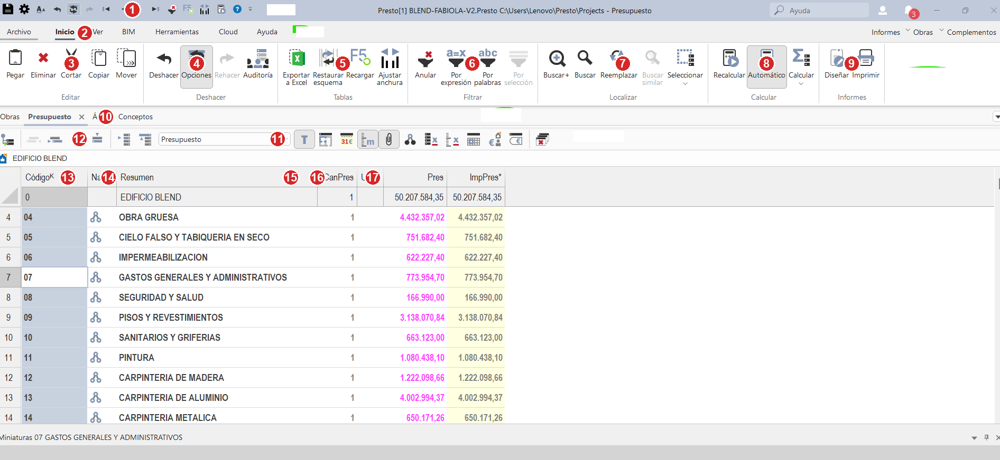

# La pantalla de Presto: dónde está cada cosa

!!! abstract "Por qué esta página va primero"
    Lo que más cuesta de Presto **no es entender los conceptos — es no perderse entre tantos menús, botones y pestañas.** Esta página es tu mapa. Volvé a ella cada vez que una instrucción te diga "andá a tal botón" y no sepas dónde está. Guardala en favoritos.

!!! tip "Cómo leemos las rutas de clic en todo el manual"
    En todas las tareas vas a ver rutas escritas así: **`Inicio ▸ grupo Filtrar ▸ Por expresión`**. Se lee de izquierda a derecha como un camino: primero la **pestaña** de la cinta (`Inicio`), después el **grupo** dentro de esa pestaña (`Filtrar`), y por último el **botón** (`Por expresión`). Con el mapa de abajo ubicás cada parte.

---

## El mapa completo

Esta es la pantalla de Presto trabajando en el presupuesto de BLEND. Cada número señala una zona; abajo está qué es cada una.

{ .on-glb }

_(Hacé clic en la imagen para verla en grande.)_

---

## Las 3 grandes franjas de la pantalla

Antes de los detalles, quedate con esto: la pantalla tiene **tres franjas horizontales**, de arriba a abajo:

1. **Arriba — los comandos** (zonas 1 a 9): la barra de íconos y la cinta de opciones. "Lo que podés hacer".
2. **Al medio — dónde estás** (zonas 10 a 12): las pestañas y el selector de vista. "En qué ventana estás parado".
3. **Abajo — tus datos** (zonas 13 a 17): la tabla con tu presupuesto. "El contenido".

---

## Franja de arriba — Los comandos

### :material-numeric-1-circle:{ style="color:#d62828" } Barra de acceso rápido
Arriba del todo. Íconos sueltos siempre a mano: **guardar**, deshacer/rehacer, navegar entre conceptos, recalcular (F5). Es el "atajo" a lo más usado, esté donde esté la cinta.

### :material-numeric-2-circle:{ style="color:#d62828" } Pestañas de la cinta
La fila **`Archivo · Inicio · Ver · BIM · Herramientas · Cloud · Ayuda`**. Cada pestaña cambia TODA la cinta de botones de abajo. Es como las solapas de un cuaderno: **`Inicio`** es donde vivís el 90% del tiempo en presupuesto.

!!! note "La trampa de la cinta"
    Si no encontrás un botón, casi siempre es porque **estás en la pestaña equivocada**. Un botón de `Herramientas` no aparece si estás en `Inicio`. Lo primero al buscar algo: confirmá en qué pestaña estás.

### Los grupos dentro de la pestaña Inicio (zonas 3 a 9)

La cinta de `Inicio` está dividida en **grupos**, y cada grupo tiene un nombre escrito **abajo** (Editar, Deshacer, Tablas…). Saber el grupo es la mitad de encontrar el botón:

| Zona | Grupo | Qué hay adentro | Para qué |
|---|---|---|---|
| :material-numeric-3-circle:{ style="color:#d62828" } | **Editar** | Pegar, Eliminar, Cortar, Copiar, Mover | Manipular filas |
| :material-numeric-4-circle:{ style="color:#d62828" } | **Deshacer** | Deshacer, **Opciones**, Rehacer, Auditoría | Revertir y configurar |
| :material-numeric-5-circle:{ style="color:#d62828" } | **Tablas** | **Exportar a Excel**, Restaurar esquema, Recargar, Ajustar anchura | Vista y exportación |
| :material-numeric-6-circle:{ style="color:#d62828" } | **Filtrar** | Anular, Por expresión, Por palabras, Por selección | Filtrar la tabla |
| :material-numeric-7-circle:{ style="color:#d62828" } | **Localizar** | Buscar+, **Buscar**, Reemplazar, Buscar similar, Seleccionar | Encontrar conceptos |
| :material-numeric-8-circle:{ style="color:#d62828" } | **Calcular** | Recalcular, **Automático**, Calcular | Forzar/gobernar los cálculos |
| :material-numeric-9-circle:{ style="color:#d62828" } | **Informes** | Diseñar, **Imprimir** | Generar entregables |

!!! warning "El botón Automático (zona 8) — recordalo"
    Si tus totales aparecen en cero o vacíos, casi siempre es porque **`Automático` está desactivado**. Verificalo acá. Es la falla silenciosa más común. Ver [Reglas de oro](5-reglas-de-oro.md).

---

## Franja del medio — Dónde estás parado

### :material-numeric-10-circle:{ style="color:#d62828" } Las pestañas de ventana
**`Obras · Presupuesto · Árbol · Conceptos`**. Estas NO son la cinta — son las **ventanas de trabajo**. Cada una muestra los mismos datos de otra forma:

| Pestaña | Qué ves |
|---|---|
| **Obras** | El listado de obras / catálogos |
| **Presupuesto** | Tu ventana de trabajo habitual (estructura + APU) |
| **Árbol** | Toda la jerarquía desplegable de un vistazo |
| **Conceptos** | La lista plana de todos los conceptos (el catálogo) |

### Selector de esquema · zona 11
El desplegable que dice **`Presupuesto`**. Define **qué columnas ves**. Si te faltan columnas (como `CanPres`), revisá que acá diga `Presupuesto` y no otro esquema. Es la segunda causa más común de "no encuentro la columna".

### Sub-barra de íconos · zona 12
Los íconos chiquitos a la izquierda del selector. Son atajos de la ventana activa: subir/bajar nivel, mostrar las subventanas (Mediciones, Texto, etc.). Son los más crípticos; pasá el mouse por encima para ver el tooltip que dice qué hace cada uno.

---

## Franja de abajo — Tus datos (las columnas)

La tabla del presupuesto. Las columnas que importan:

| Zona | Columna | Qué es |
|---|---|---|
| **13** | **Código** | El identificador único del concepto |
| **14** | **NatC** | La naturaleza (el ícono: capítulo, partida, material…) |
| **15** | **Resumen** | La descripción del concepto |
| **16** | **CanPres** | La cantidad |
| — | **Ud** | La unidad de medida |
| **17** | **Pres** | El precio unitario _(negro = tecleado; magenta = calculado)_ |
| — | **ImpPres** | El importe = cantidad × precio |

!!! tip "Leé los colores"
    En la captura, los precios de los capítulos están en **magenta** porque son calculados (suma de lo que tienen adentro). El número negro sería un precio tecleado a mano. Aprendé a leerlos: te dice de un vistazo si un precio está respaldado o puesto a dedo. Detalle en [Fundamentos](0-fundamentos.md).

---

Ya tenés el mapa

Con esto, cuando una tarea diga "andá a <code>Inicio ▸ Filtrar ▸ Por expresión</code>", sabés exactamente dónde mirar. Ahora sí, seguí con <a href="../0-fundamentos/">0 · Fundamentos de Presto</a> para el modelo mental, o saltá directo a <a href="../1-basico/">1 · Presupuesto básico</a>.

---

📖 **Fuente:** captura real de Presto 2026 sobre la obra BLEND-FABIOLA + Manual de Presto completo (RIB).
